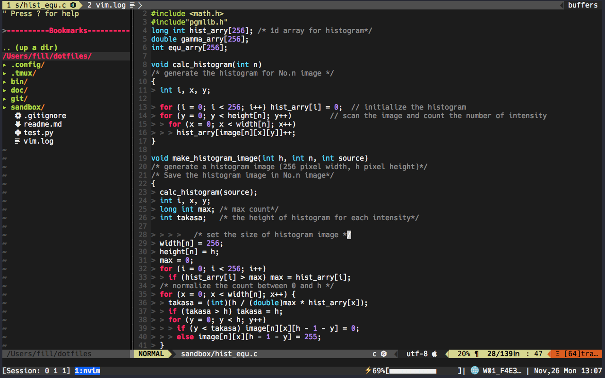

# README

## インストール方法

未実装

```bash
$ hogehoge.sh
```

- 現在 make で書こうかと検討(2018/11/17)

## 関連するパッケージ

### done

- .config
- 拾い集めた shell たち
- git

### WIP

- ドキュメント
- tmux
  - ステータスの部分を powerline(風)にしたい計画

### todo

- vim
- brew で入れたもの一覧
- fish の prompt 部分を powerline で自作したい

---

## 注意

- vim のプラグインによって通常のフォントだと文字化けするので注意
  > Install a [Nerd Font](https://github.com/ryanoasis/nerd-fonts#font-installation) compatible font or patch your own. Then set your terminal font.

## Screenshots


