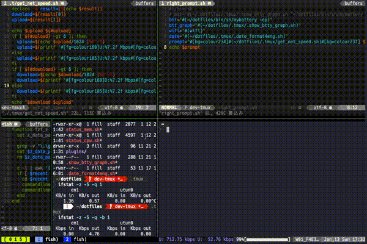

# README

## インストール方法

未実装
`bash $ hogehoge.sh`

- 現在 make で書こうかと検討(2018/11/17)

## 注意 - vim のプラグインによって通常のフォントだと文字化けするので注意

> Install a [NerdFont](https://github.com/ryanoasis/nerd-fonts#font-installation) compatible fontor patch your own. Then set your terminal font.

## Screenshots

